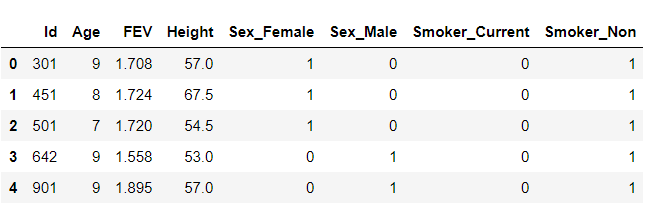
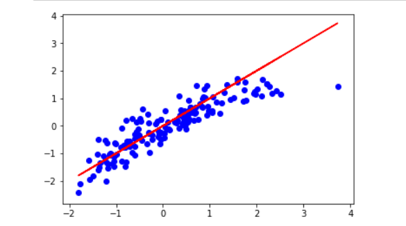

# Childhood_Respiratory_Disease
## Objective:
Use Scikit-learn's [documentation](http://scikit-learn.org/stable/modules/linear_model.html) to compare several linear models to predict the effect of smoking on childhood respiratory disease.The familiar `model->fit->predict` pattern is used for each model.

## Background:

Description FEV (forced expiratory volume) is an index of pulmonary function that measures the volume of air expelled after one second of constant effort. The data contains determinations of FEV on 654 children ages 6-22 who were seen in the Childhood Respiratory Desease Study in 1980 in East Boston, Massachusetts. The data are part of a larger study to follow the change in pulmonary function over time in children.

ID - ID number Age - years FEV - litres Height - inches Sex - Male or Female Smoker - Non = nonsmoker, Current = current smoker

Source Tager, I. B., Weiss, S. T., Rosner, B., and Speizer, F. E. (1979). Effect of parental cigarette smoking on pulmonary function in children. American Journal of Epidemiology, 110, 15-26. Rosner, B. (1990). Fundamentals of Biostatistics, 3rd Edition. PWS-Kent, Boston, Massachusetts.

* Used pandas's `get_dummies` function to convert the categorical data to binary values.

* Fitted a standard scaler model to the training data.

* Applied the scaler transform to both the training and testing data.

* Compared the performance for each of the following models: `LinearRegression`, `Lasso`, `Ridge`, and `ElasticNet`.

    * For each of the models, computed the MSE and R2 score for the test data.
    
    * Linear Regression Model  
    
    
    * Lasso Model
    
    
    * Ridge Model
    
    
    * ElasticNet Model
    

* Also, Plotted the Residuals for the Training and Testing data.

